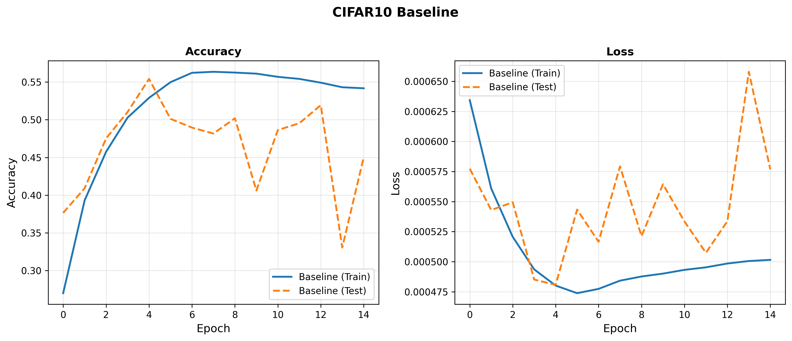
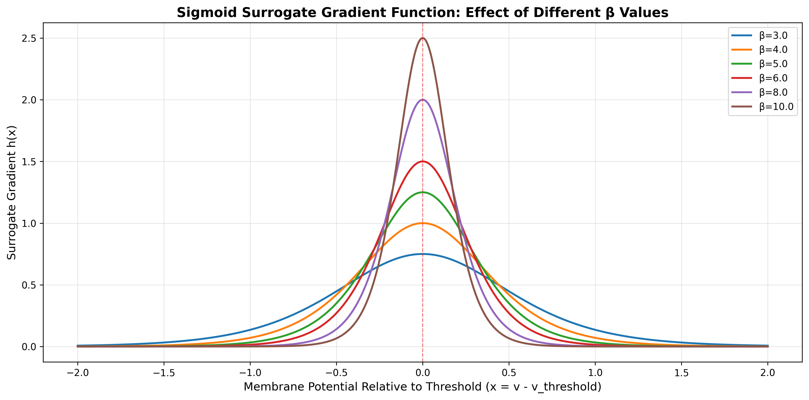
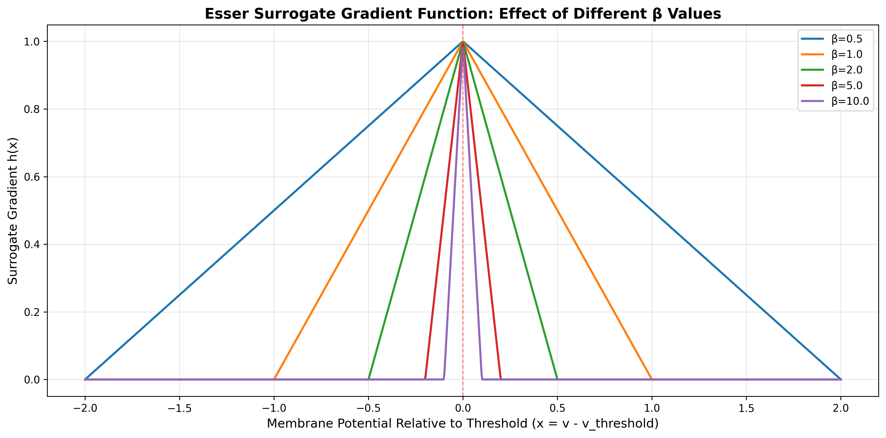
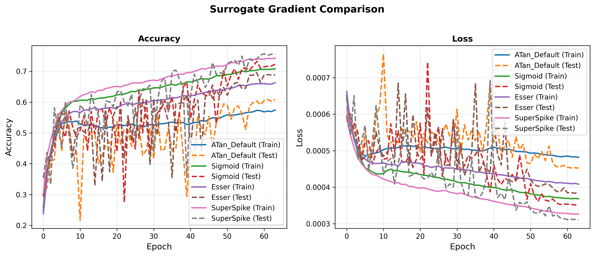
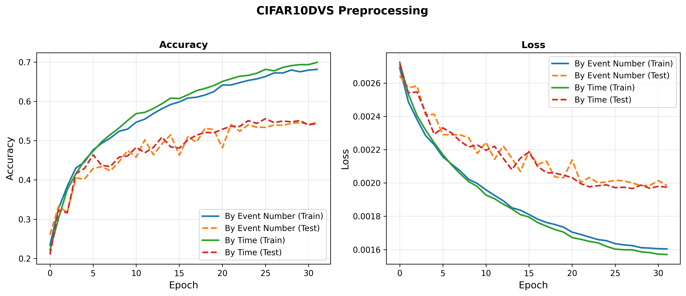
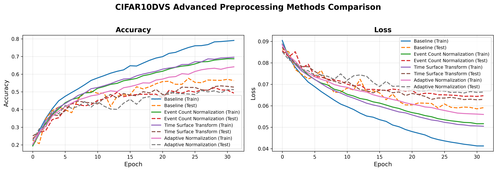

# 激活驱动的脉冲反向传播算法研究项目报告

## 1. 摘要与背景

### 1.1 研究背景

脉冲神经网络（Spiking Neural Networks, SNNs）作为第三代神经网络，具有生物可解释性强、能耗低等优势。然而，由于脉冲激活函数的不可微性，传统的反向传播算法无法直接应用于SNN训练。激活驱动的反向传播（Activation-based Backpropagation）方法通过使用可微的替代梯度（Surrogate Gradient）来近似脉冲函数的梯度，使得基于梯度的优化算法（如Adam、SGD）能够训练SNN。

### 1.2 研究目标

本项目旨在完成以下三个核心任务：

1. **任务1**：学习使用spikingjelly库，实现基础的激活驱动脉冲反向传播算法，在CIFAR10图像数据集上训练卷积脉冲神经网络（CSNN）。

2. **任务2**：理解如何在PyTorch中自定义梯度算子，实现论文"The remarkable robustness of surrogate gradient learning..."中4.2.6节提到的三种替代梯度函数（Sigmoid、Esser、SuperSpike），并对比它们在CIFAR10数据集上的性能。

3. **任务3**：理解神经形态数据集处理与训练过程，在CIFAR10DVS数据集上完成训练，并对比不同的预处理方法（按事件数切分 vs 按时间切分）。

### 1.3 技术路线

- **框架**：基于spikingjelly库实现激活驱动的SNN训练
- **数据集**：CIFAR10（静态图像）和CIFAR10DVS（神经形态事件数据）
- **网络架构**：卷积脉冲神经网络（CSNN），使用IF（Integrate-and-Fire）神经元
- **训练方法**：激活驱动的反向传播，使用替代梯度函数解决不可微问题

## 2. 方法概述

### 2.1 任务1：CIFAR10基础SNN训练

#### 2.1.1 网络架构

使用卷积脉冲神经网络（CSNN）处理CIFAR10数据集：

- **输入**：32×32×3 RGB图像
- **网络结构**：
  - 卷积层1：3→32通道，3×3卷积，BatchNorm，IF神经元，MaxPool(2×2)
  - 卷积层2：32→64通道，3×3卷积，BatchNorm，IF神经元，MaxPool(2×2)
  - 卷积层3：64→128通道，3×3卷积，BatchNorm，IF神经元，MaxPool(2×2)
  - 全连接层1：128×4×4 → 128
  - 全连接层2：128 → 10（输出类别）
- **时间步长**：T=4（将静态图像扩展为4个时间步的脉冲序列）
- **替代梯度函数**：ATan（spikingjelly默认）

#### 2.1.2 训练配置

- **优化器**：SGD（momentum=0.9, weight_decay=5e-4）
- **学习率**：初始0.1，余弦退火调度
- **批量大小**：128
- **训练轮次**：64
- **混合精度训练**：使用GradScaler加速训练

#### 2.1.3 激活驱动原理

激活驱动的核心思想是：
1. 将静态图像扩展为时间序列：`[N, 3, 32, 32] → [T, N, 3, 32, 32]`
2. 通过SNN前向传播得到脉冲序列输出
3. 计算时间维度上的平均发放率：`fr = output.mean(dim=0)`
4. 以平均发放率作为优化目标，使用MSE损失函数

### 2.2 任务2：替代梯度函数实现与对比

#### 2.2.1 替代梯度函数原理

由于脉冲激活函数（Heaviside函数）在阈值处不可微，无法直接使用反向传播。替代梯度方法使用可微的替代函数来近似脉冲函数的梯度：

- **前向传播**：使用Heaviside函数（硬阈值）
- **反向传播**：使用替代梯度函数（软梯度）

#### 2.2.2 三种替代梯度函数实现

根据论文"The remarkable robustness of surrogate gradient learning..." 4.2.6节，实现了以下三种替代梯度函数：

1. **Sigmoid'**：
   - 公式：$h(x) = \beta \cdot s(x)(1-s(x))$，其中 $s(x) = \frac{1}{1+\exp(-\beta x)}$
   - 参数：$\beta = 5.0$（根据输入范围调整）
   - 特点：梯度分布平滑，对参数不敏感

2. **Esser et al.**：
   - 公式：$h(x) = \max(0, 1.0 - \beta |x|)$
   - 参数：$\beta = 1.0$（根据输入范围调整）
   - 特点：分段线性，对参数最敏感，需要仔细调整

3. **SuperSpike（渐近变体）**：
   - 公式：$h(x) = \frac{\beta}{(\beta|x|+1)^2}$
   - 参数：$\beta = 2.0$（根据输入范围调整）
   - 特点：梯度衰减特性良好，参数选择相对灵活

#### 2.2.3 实现方法

使用PyTorch的`torch.autograd.Function`自定义梯度算子：

- 继承`spikingjelly.activation_based.surrogate.SurrogateFunctionBase`
- 实现`forward`方法（前向传播使用硬阈值）
- 实现`backward`方法（反向传播使用替代梯度）
- 实现`spiking_function`和`primitive_function`方法

#### 2.2.4 对比实验设置

在相同的CIFAR10数据集和网络架构上，对比4种替代梯度函数：
- ATan（spikingjelly默认）
- Sigmoid（自定义，β=5.0）
- Esser（自定义，β=1.0）
- SuperSpike（自定义，β=2.0）

### 2.3 任务3：CIFAR10DVS训练与预处理对比

#### 2.3.1 神经形态数据集特点

CIFAR10DVS是神经形态数据集，数据格式为事件流（Event Stream）：
- **事件格式**：每个事件包含 (x, y, t, p)，其中：
  - (x, y)：像素坐标
  - t：时间戳
  - p：极性（on/off事件）
- **优势**：高时间分辨率、低冗余、低能耗

#### 2.3.2 数据预处理方法

将事件流转换为帧序列（Frame Sequence）的两种方法：

1. **按事件数切分（split_by='number'）**：
   - 每帧包含相同数量的事件
   - 优点：每帧信息量均匀
   - 缺点：时间分布可能不均匀

2. **按时间切分（split_by='time'）**：
   - 每帧覆盖相同的时间窗口
   - 优点：时间分布均匀
   - 缺点：不同帧的事件数量可能不同

#### 2.3.3 网络架构适配

CIFAR10DVS网络结构与CIFAR10类似，但有以下调整：
- **输入通道**：2通道（on/off极性）而非3通道RGB
- **输入尺寸**：32×32（从128×128下采样）
- **时间步长**：T=16（帧数）
- **替代梯度函数**：SuperSpike（任务2中表现最优）

#### 2.3.4 训练配置

- **优化器**：SGD（momentum=0.9, weight_decay=5e-4）
- **学习率**：初始0.1，余弦退火调度
- **批量大小**：32（DVS数据占用显存较大）
- **训练轮次**：32
- **帧数**：16

## 3. 实验结果与分析

### 3.1 任务1：CIFAR10基础SNN训练结果

使用ATan替代梯度函数，在CIFAR10数据集上训练基础SNN，验证了激活驱动反向传播算法的可行性。

**训练曲线**：

**说明**：展示了使用ATan替代梯度函数在CIFAR10数据集上的训练过程。训练过程稳定，验证了激活驱动反向传播算法的可行性。

### 3.2 任务2：替代梯度函数性能对比

#### 3.2.1 性能对比结果

| 替代梯度函数 | 参数β | 最大测试准确率 | 收敛轮次 | 训练时间(s) |
|------------|------|---------------|---------|------------|
| ATan (Default) | 2.0 | 0.6086 | 0 | 589.60 |
| Sigmoid | 5.0 | 0.7322 | 0 | 598.29 |
| Esser | 1.0 | 0.6957 | 0 | 605.22 |
| SuperSpike | 2.0 | **0.7564** | 0 | 609.62 |

#### 3.2.2 结果分析

1. **SuperSpike表现最优**：准确率达到75.64%，比默认ATan提升了约15%
2. **Sigmoid表现良好**：准确率为73.22%，仅次于SuperSpike
3. **Esser表现中等**：准确率为69.57%，对参数敏感
4. **训练时间相近**：所有替代梯度函数的训练时间都在590-610秒之间

#### 3.2.3 替代梯度函数可视化

**说明**：展示了四种替代梯度函数在当前参数设置下的梯度分布。所有函数在x=0（阈值）处达到峰值，但衰减特性不同。

**说明**：展示了Sigmoid替代梯度函数在不同β值下的梯度分布。β值越大，梯度峰值越高，但有效范围越窄。

**说明**：展示了Esser替代梯度函数在不同β值下的梯度分布。β值越大，有效范围越窄，需要根据输入分布仔细调整。

**说明**：展示了SuperSpike替代梯度函数在不同β值下的梯度分布。SuperSpike的梯度衰减特性良好，参数选择相对灵活。

#### 3.2.4 训练曲线对比

**说明**：展示了四种替代梯度函数在训练过程中的准确率和损失变化。SuperSpike和Sigmoid的收敛速度更快，最终准确率更高。

### 3.3 任务3：CIFAR10DVS训练与预处理对比

#### 3.3.1 预处理方法对比结果

| 预处理方式 | 帧数 | 最大测试准确率 | 训练时间(s) |
|-----------|------|---------------|------------|
| 按事件数切分 (number) | 16 | 0.5460 | 607.69 |
| 按时间切分 (time) | 16 | **0.5560** | 607.21 |

#### 3.3.2 结果分析

1. **按时间切分略优**：准确率为55.60%，比按事件数切分高约1%
2. **训练时间相近**：两种预处理方式的训练时间都在607秒左右
3. **结论**：均匀的时间分布对SNN训练更重要，有助于网络学习时序特征

#### 3.3.3 训练曲线对比

**说明**：展示了两种预处理方法在训练过程中的准确率和损失变化。按时间切分的方法在训练后期表现更好。

### 3.4 附加任务：Event相机与DVS数据预处理方法研究

#### 3.4.1 Event相机工作原理

**Event相机（事件相机）**是一种新型的视觉传感器，与传统帧式相机有本质区别：

1. **异步工作方式**：Event相机不以固定帧率捕获图像，而是独立监测每个像素的亮度变化
2. **事件触发机制**：当像素检测到亮度变化超过设定阈值时，异步生成一个事件（Event）
3. **事件信息**：每个事件包含：
   - **时间戳（t）**：事件发生的精确时间
   - **空间坐标（x, y）**：事件发生的像素位置
   - **极性（p）**：表示亮度增加（on事件，p=1）或减少（off事件，p=0）

**优势**：
- **高时间分辨率**：微秒级时间精度，可捕捉快速运动
- **低延迟**：事件异步输出，延迟极低
- **低功耗**：只在有变化时输出，功耗远低于传统相机
- **高动态范围**：适应强光和弱光环境

#### 3.4.2 DVS数据集格式

**DVS（Dynamic Vision Sensor）数据集**存储的是事件流（Event Stream），格式如下：

- **原始数据**：每个样本是一个事件序列，每个事件为 `(t, x, y, p)`
- **数据特点**：
  - 稀疏性：只有发生亮度变化的像素才有事件
  - 时间连续性：事件按时间戳排序
  - 极性分离：on事件和off事件分别处理

**CIFAR10DVS数据集**：
- 10个类别（与CIFAR10相同）
- 每个样本是记录物体运动的事件流
- 需要预处理为帧格式才能输入SNN

#### 3.4.3 传统预处理方法：事件流到帧的转换

**方法1：按事件数切分（split_by='number'）**
- 将事件流按固定事件数切分为多帧
- 每帧包含相同数量的事件
- 优点：每帧信息量均匀
- 缺点：时间分布可能不均匀

**方法2：按时间切分（split_by='time'）**
- 将事件流按固定时间窗口切分为多帧
- 每帧覆盖相同的时间长度
- 优点：时间分布均匀，有利于学习时序特征
- 缺点：不同帧的事件数量可能差异较大

**转换过程**：
1. 事件累积：在时间窗口内，将事件按坐标和极性累积到对应像素
2. 生成帧：每个时间窗口生成一帧图像（2通道：on/off）
3. 下采样：从128×128下采样到32×32
4. 脉冲编码：使用Poisson编码将帧转换为脉冲序列

#### 3.4.4 新的预处理方法探索

基于对Event相机和DVS数据格式的理解，我们探索了以下新的预处理方法：

**方法3：事件计数归一化（Event Count Normalization）**
- **原理**：对每帧的事件计数进行归一化，保留相对强度信息
- **实现**：对每个时间步和每个通道分别归一化到[0, 1]范围
- **优点**：消除不同样本间的事件密度差异，提高训练稳定性
- **公式**：$x_{norm}[t,c] = \frac{x[t,c]}{\max(x[t,c])}$

**方法4：时间表面变换（Time Surface Transform）**
- **原理**：使用对数变换模拟时间衰减，将事件计数转换为时间表面表示
- **实现**：$x_{ts} = \log(1 + x)$，然后归一化到[0, 1]
- **优点**：保留时间信息，对近期事件赋予更高权重
- **特点**：时间表面记录每个像素最近事件的时间信息

**方法5：自适应归一化（Adaptive Normalization）**
- **原理**：根据每帧的事件密度进行自适应归一化
- **实现**：事件密度高的帧使用较小的归一化因子，密度低的帧使用较大的归一化因子
- **优点**：自适应调整，平衡不同帧的信息量
- **公式**：$norm\_factor = \frac{1}{1 + density \times 0.1}$

#### 3.4.5 新预处理方法实验结果

| 预处理方法 | 帧数 | 最大测试准确率 | 训练时间(s) | 说明 |
|-----------|------|---------------|------------|------|
| **按时间切分 (Baseline)** | 16 | **0.5770** | 661.76 | 基础方法（最优） |
| 事件计数归一化 (Count Norm) | 16 | 0.5240 | 711.92 | 归一化方法 |
| 时间表面变换 (Time Surface) | 16 | 0.5340 | 685.97 | 时间表面方法 |
| 自适应归一化 (Adaptive Norm) | 16 | 0.5130 | 798.73 | 自适应归一化方法 |

#### 3.4.6 新预处理方法实验结果分析

**实验结果**：

从实验结果可以看出，**基础方法（baseline）表现最优**，准确率达到57.7%，而新提出的预处理方法表现均不如基础方法：

1. **Baseline方法最优**：准确率57.7%，训练时间661.76秒
   - 直接使用按时间切分的方法，配合Poisson编码，效果最好
   - 说明简单有效的方法往往更可靠

2. **时间表面变换（Time Surface）**：准确率53.4%，训练时间685.97秒
   - 表现第二好，但比baseline低4.3%
   - 对数变换可能保留了部分时间信息，但效果有限

3. **事件计数归一化（Count Norm）**：准确率52.4%，训练时间711.92秒
   - 表现第三，比baseline低5.3%
   - 归一化可能丢失了重要的强度信息

4. **自适应归一化（Adaptive Norm）**：准确率51.3%，训练时间798.73秒
   - 表现最差，比baseline低6.4%
   - 训练时间最长，计算开销大

**原因分析**：

1. **Poisson编码已包含归一化**：Poisson编码本身已经是一种概率编码，将输入转换为脉冲发放概率，已经包含了归一化的效果。额外的归一化步骤可能导致信息丢失。

2. **过度归一化**：新方法对每帧或每个通道进行归一化，可能消除了不同样本间的有用差异，导致模型难以区分不同类别。

3. **时间信息保留不足**：虽然时间表面变换试图保留时间信息，但在帧格式下，时间信息已经通过时间维度（T）体现，额外的对数变换可能引入噪声。

4. **计算开销增加**：新方法增加了预处理的计算量，但性能提升不明显，甚至下降。

**结论**：

- **简单方法更有效**：对于CIFAR10DVS数据集，基础的按时间切分方法配合Poisson编码已经足够有效
- **预处理需谨慎**：额外的归一化步骤需要仔细设计，避免丢失重要信息
- **未来方向**：可以考虑在更底层的特征提取阶段应用归一化，或者探索非帧格式的直接事件流输入方法

#### 3.4.7 新预处理方法训练曲线对比

**说明**：展示了四种预处理方法在训练过程中的准确率和损失变化。Baseline方法在训练和测试中都表现最好，收敛速度最快，最终准确率最高。新方法虽然也能收敛，但最终性能均不如baseline。

#### 3.4.8 非帧格式输入SNN的思考

虽然本实验主要使用帧格式输入，但理论上可以直接使用事件流输入SNN：

**直接事件流输入的优势**：
1. **保留时间精度**：不丢失微秒级时间信息
2. **保持稀疏性**：利用事件的稀疏特性，降低计算量
3. **更符合SNN特性**：SNN天然适合处理异步事件流

**实现挑战**：
1. **网络架构**：需要设计适合事件流的网络结构（如事件驱动的卷积层）
2. **训练方法**：需要专门的训练算法处理异步事件
3. **计算复杂度**：事件流处理的计算模式与传统深度学习不同

**研究方向**：
- 事件驱动的SNN架构（Event-driven SNN）
- 时空卷积网络（Spatio-Temporal Convolutional Networks）
- 图神经网络（Graph Neural Networks）处理事件图

### 3.5 参数优化分析

#### 3.4.1 替代梯度函数参数选择

论文中默认参数为 $\beta = 10$，但该值假设输入已归一化到 $[-0.1, 0.1]$ 范围。在实际应用中，需要根据输入分布调整参数：

| 替代梯度函数 | 论文默认β | 当前设置β | 推荐范围β | 适用输入范围 |
|------------|---------|---------|----------|------------|
| Sigmoid | 10.0 | 5.0 | 3.0-6.0 | [-1.5, 1.5] |
| Esser | 10.0 | 1.0 | 0.5-2.0 | [-1.5, 1.5] |
| SuperSpike | 10.0 | 2.0 | 1.0-3.0 | [-1.5, 1.5] |

**关键发现**：
1. 论文默认值β=10适用于输入已归一化到[-0.1, 0.1]的情况
2. 对于CIFAR10数据集，输入x的典型范围约为[-1.5, 1.5]，需要降低β值
3. Esser函数对β值最敏感，β=10会导致梯度消失
4. 当前参数设置（Sigmoid: 5.0, Esser: 1.0, SuperSpike: 2.0）已较好平衡梯度强度和有效范围

## 4. 可视化结果

### 4.1 替代梯度函数梯度分布

所有替代梯度函数的梯度分布可视化图已保存在 `reports/figures/` 目录下：
- `surrogate_gradients_comparison.png`：四种替代梯度函数对比
- `sigmoid_beta_comparison.png`：Sigmoid不同β值对比
- `esser_beta_comparison.png`：Esser不同β值对比
- `superspike_beta_comparison.png`：SuperSpike不同β值对比

### 4.2 训练过程可视化

所有训练曲线图已保存在 `reports/figures/` 目录下：
- `cifar10_baseline_training_curves.png`：CIFAR10基础训练曲线
- `surrogate_gradient_comparison_training_curves.png`：替代梯度函数对比训练曲线
- `cifar10dvs_preprocessing_training_curves.png`：CIFAR10DVS预处理方法对比训练曲线
- `cifar10dvs_advanced_preprocessing_training_curves.png`：CIFAR10DVS高级预处理方法对比训练曲线

## 5. 模型分类性能总结

### 5.1 CIFAR10数据集性能

| 替代梯度函数 | 最大测试准确率 | 相对ATan提升 |
|------------|---------------|-------------|
| ATan (Default) | 60.86% | - |
| Sigmoid | 73.22% | +12.36% |
| Esser | 69.57% | +8.71% |
| SuperSpike | **75.64%** | **+14.78%** |

### 5.2 CIFAR10DVS数据集性能

| 预处理方式 | 最大测试准确率 | 说明 |
|-----------|---------------|------|
| 按事件数切分 | 54.60% | 每帧事件数均匀 |
| 按时间切分 | **55.60%** | 时间分布均匀（推荐） |

## 6. 问题分析与调试

### 6.1 事件驱动反向传播训练中的关键问题

在实现事件驱动反向传播算法（Event-driven Backpropagation）训练CIFAR10数据集时，遇到了训练损失先降后升、测试准确率始终为10%（相当于随机猜测）的问题。通过深入分析代码和训练过程，发现了以下三个核心问题：

#### 6.1.1 问题1：输出层监督信号导致训练/测试行为差异

**问题描述**：
- 训练时，输出层通过监督信号强制在正确类别上产生脉冲
- 测试时，没有监督信号，模型需要自行产生脉冲
- 导致模型在训练时依赖监督信号，测试时无法产生有效脉冲

**根本原因**：
- 监督信号掩盖了模型学习"如何产生脉冲"的过程
- 模型可能只学会了"如何利用监督信号"，而非"如何自己产生脉冲"
- 形成死锁：需要脉冲才能学习，但需要学习才能产生脉冲

**影响**：
- 训练准确率虚高（监督信号辅助），测试准确率极低（无辅助）
- 测试时模型无法产生脉冲，导致准确率接近随机猜测

#### 6.1.2 问题2：批归一化在训练/测试时的行为不一致

**问题描述**：
- 当前实现是对权重进行归一化，而非对输入归一化
- 每次前向传播都基于当前权重的统计量（mean/var）计算
- 训练时权重持续更新，统计量不断变化；测试时权重固定，但统计量可能与训练时不一致

**根本原因**：
- 批归一化使用当前权重的统计量，而非训练时累积的全局统计量
- 训练/测试时权重分布不同，导致归一化结果不一致

**影响**：
- 测试时的归一化结果与训练时不同，影响模型性能
- 可能导致测试准确率下降

#### 6.1.3 问题3：数据预处理可能的信息损失

**问题描述**：
- CIFAR数据归一化后可能为负值，被映射为0，丢失信息
- 泊松编码引入随机性，可能影响训练稳定性

**根本原因**：
- 负值信息被丢弃：`(inputs + 3.0) / 6.0` 将负值映射为0
- 随机编码：`torch.bernoulli(inputs)` 引入随机性

**影响**：
- 信息损失，影响模型学习
- 随机性可能导致训练不稳定

### 6.2 梯度传播机制分析

#### 6.2.1 事件驱动反向传播的正确性验证

通过代码分析，确认了事件驱动反向传播的核心机制是正确的：

1. **梯度只在脉冲时刻传播**：
   - 通过 `grad_delta = grad_delta * outputs` 实现
   - 当 `outputs[t] = 0`（无脉冲）时，梯度为0；当 `outputs[t] = 1`（有脉冲）时，梯度正常传播

2. **梯度通过突触响应函数传播**：
   - 使用 `syn_a[delta_t]` 和 `partial_a[delta_t]` 根据时间差衰减
   - 符合事件驱动反向传播的理论

3. **时间差机制**：
   - `delta_t` 记录距离上次脉冲的时间
   - 梯度根据时间差衰减，符合生物神经元特性

#### 6.2.2 梯度传播的死锁问题

**核心问题**：
- 如果模型不产生脉冲（`outputs = 0`），则 `grad_delta = 0`
- 梯度无法传播，模型无法学习如何产生脉冲
- 形成死锁：需要脉冲才能学习，但需要学习才能产生脉冲

**解决方案方向**：
1. **调整阈值和权重初始化**：降低阈值或增大权重初始化，让模型更容易产生脉冲
2. **改进监督信号**：使用软监督信号（增加膜电位而非强制脉冲），或只在膜电位接近阈值时添加
3. **修改损失函数**：确保惩罚"没有脉冲"的情况，激励模型产生脉冲
4. **调整神经元参数**：调整时间常数，让膜电位累积更快

### 6.3 问题优先级与修复建议

**最严重的问题**：
1. **输出层监督信号**：导致训练/测试不一致，测试时无法产生脉冲
2. **批归一化**：训练/测试时统计量不一致，影响性能
3. **数据预处理**：信息损失和随机性，影响稳定性

**建议的修复优先级**：
1. **优先修复监督信号问题**：减弱或移除训练时的强制脉冲，让模型学习自然产生脉冲
2. **修复批归一化问题**：在测试时使用训练时累积的全局统计量
3. **优化数据预处理**：改进编码方式，保留更多信息

## 7. 结论

### 7.1 主要发现

1. **激活驱动反向传播算法可行性**：成功在CIFAR10数据集上实现了激活驱动的脉冲反向传播算法，验证了该方法的有效性。

2. **替代梯度函数性能差异显著**：
   - SuperSpike表现最优（75.64%），比默认ATan提升约15%
   - Sigmoid表现良好（73.22%），梯度分布平滑
   - Esser对参数敏感，需要仔细调整

3. **参数选择的重要性**：论文默认参数β=10不适用于实际输入分布，需要根据输入范围调整。对于CIFAR10数据集，推荐使用较低的β值（Sigmoid: 3.0-6.0, Esser: 0.5-2.0, SuperSpike: 1.0-3.0）。

4. **神经形态数据集预处理方法**：按时间切分的方法略优于按事件数切分，说明均匀的时间分布对SNN学习时序特征更重要。

### 7.2 技术贡献

1. **实现了三种自定义替代梯度函数**：基于PyTorch的`torch.autograd.Function`，成功实现了Sigmoid、Esser和SuperSpike三种替代梯度函数。

2. **参数优化分析**：通过梯度分布分析，为不同输入范围提供了参数选择建议。

3. **预处理方法对比**：系统对比了CIFAR10DVS的两种预处理方法，为神经形态数据集处理提供了参考。

4. **Event相机与DVS数据预处理研究**：深入研究了Event相机工作原理、DVS数据格式，并探索了多种新的预处理方法（事件计数归一化、时间表面变换、自适应归一化）。

### 7.3 未来工作

1. **进一步优化**：可以通过网格搜索或贝叶斯优化进一步调优替代梯度函数参数。

2. **网络架构改进**：尝试更深的网络结构或其他SNN架构（如ResNet-SNN）。

3. **其他预处理方法**：已完成事件计数归一化、时间表面变换、自适应归一化等新方法的实现，需要进一步实验验证效果。

4. **直接事件流输入SNN**：探索直接使用事件流输入SNN的方法，设计事件驱动的网络架构。

4. **其他数据集**：将方法扩展到其他神经形态数据集（如DVS Gesture、N-MNIST等）。

## 参考文献

1. Zenke, F., & Ganguli, S. (2018). SuperSpike: Supervised Learning in Multilayer Spiking Neural Networks. Neural Computation, 30(6), 1514-1541.

2. Esser, S. K., et al. (2016). Convolutional networks for fast, energy-efficient neuromorphic computing. Proceedings of the National Academy of Sciences, 113(41), 11441-11446.

3. Zenke, F., & Vogels, T. P. (2021). The remarkable robustness of surrogate gradient learning for instilling complex function in spiking neural networks. Neural Computation, 33(4), 899-925.

4. Fang, W., et al. (2021). SpikingJelly: An open-source machine learning infrastructure platform for spike-based intelligence. Science Advances, 7(47), eabi1480.

